[English](README.md) | [简体中文](README.zh.md) | [日本語](README.ja.md) | [Français](README.fr.md) | [Deutsch](README.de.md) | [Español](README.es.md)

<h1 align="center">Editor Folyn</h1>

<p align="center">
  Local primero · Vault aislado · IA nativa<br/>
  Local-first, vault-based, AI-native knowledge workspace.
</p>

<p align="center">
  
  
  
  
</p>

---

> Una app, todo tu contexto. Aísla cada conjunto de datos en un Vault, reúne markdown, pizarras, diagramas ER y mapas mentales en un solo editor, y conecta los agentes de IA directamente a tu flujo — todo permanece en tus propios dispositivos.

## For Users

### Notas sobre el primer inicio

La app no está firmada con código; el sistema la bloqueará en el primer inicio. Desbloquéala así:

- **Windows**: Al primer inicio verás una advertencia de SmartScreen “Windows protegió tu PC”. Haz clic en **Más información → Ejecutar de todos modos**.
- **macOS**: Si aparece “no se puede abrir” o “está dañado” tras la instalación, ejecuta en Terminal:
  ```bash
  xattr -cr /Applications/Folyn.app
  ```
  Luego vuelve a abrir desde Launchpad.

## Why Folyn

- **Aislamiento multi-Vault** — Abre un Vault separado para cada proyecto o conjunto de notas. Los datos son independientes entre sí, cambia en cualquier momento. Tu dispositivo local es la única fuente de verdad.
- **Edición multiformato** — Markdown (con extensions de contenedor: Button / Callout / Card / Tabs / Timeline / Steps / Grid / FilePreview / StatusTag / Collapsible, más contenedores de diagramas Graphviz / Mermaid / PlantUML), texto enriquecido, CSV, JSON, mapas mentales markmap, diagramas ER dbml, diagramas de arquitectura drawio, pizarras manuales excalidraw, DOT graphviz — un editor para todo.
- **Vista previa universal** — Documentos de Office, audio/vídeo, archivos comprimidos, libros electrónicos, presentaciones y planos — visualízalos sin salir de Folyn.
- **Integración profunda de IA** — Adaptadores integrados para seis agentes CLI: Claude Code, Codex CLI, Gemini CLI, Opencode, Pi Code Agent, Qoder. Cambia libremente entre proveedores de modelos, sin atarte a uno.
- **Asistente mascota de escritorio** — Un compañero residente en el escritorio que envía recordatorios de calendario y notificaciones de cambios de tareas; un clic abre un chat con el LLM.
- **Terminal integrada** — Abre una terminal dentro de Folyn y deja que Claude Code / Codex / otros agentes CLI lean y escriban el documento actual — sin cambiar de ventana.
- **Recolección de actividad** — Las extensiones recolectoras registran tu día — cambios de ventana, modificaciones de archivos, actividad de GitHub, eventos webhook — en una base de datos local del vault; revísalo en una línea de tiempo y un grafo de relaciones, y genera informes diarios/semanales/mensuales como notas del vault (opcionalmente escritos por IA).
- **Sistema de extensions** — Arquitectura de microkernel + SDK de extension. Texto enriquecido, DBML, visor de archivos y recolectores de actividad se entregan como extensions, la traducción está integrada; se admiten extensiones de terceros.
- **Entrada por voz** — Voz a texto con pulido automático, pegado directo en el cursor (actualmente solo macOS).

### Aislamiento multi-Vault

Abre un Vault separado para cada proyecto o conjunto de notas. Cada Vault es su propio espacio de datos — notas, adjuntos y configuraciones de extensions se almacenan de forma independiente; cambiar de Vault es como cambiar de entorno de trabajo completo. Los datos permanecen en el dispositivo local; no se requiere cuenta en la nube.

<p align="center">
  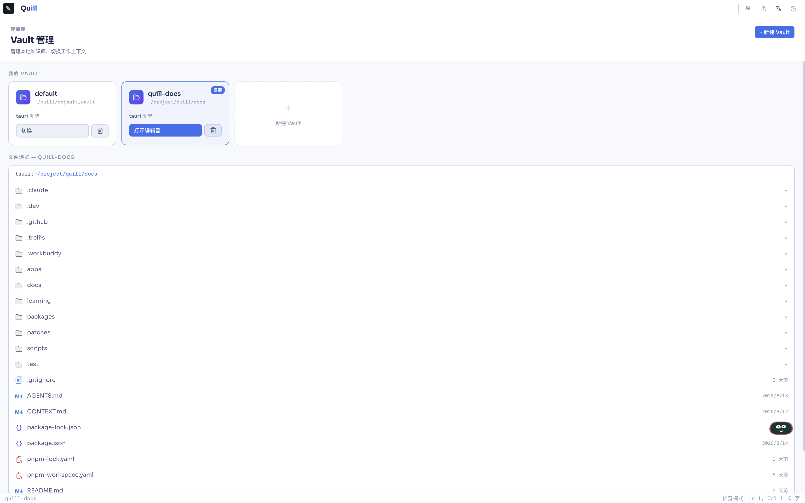
</p>

### Edición multiformato

- **Markdown** — Sintaxis estándar + un conjunto de extensions de contenedor: Button / Callout / Card / Collapsible / FilePreview / Grid / StatusTag / Steps / Tabs / Timeline, más contenedores de diagramas Graphviz / Mermaid / PlantUml
- **Texto enriquecido** — WYSIWYG, para composiciones que no necesitan sintaxis markdown
- **Datos estructurados** — CSV, JSON, editados directamente
- **Mapas mentales** — markmap, esquemas markdown auto-renderizados como estructura visual
- **Modelado y diagramas** — dbml (ER) / drawio (arquitectura, flujo) / excalidraw (pizarra manual) / graphviz (DOT) / plantuml / mermaid

<p align="center">
  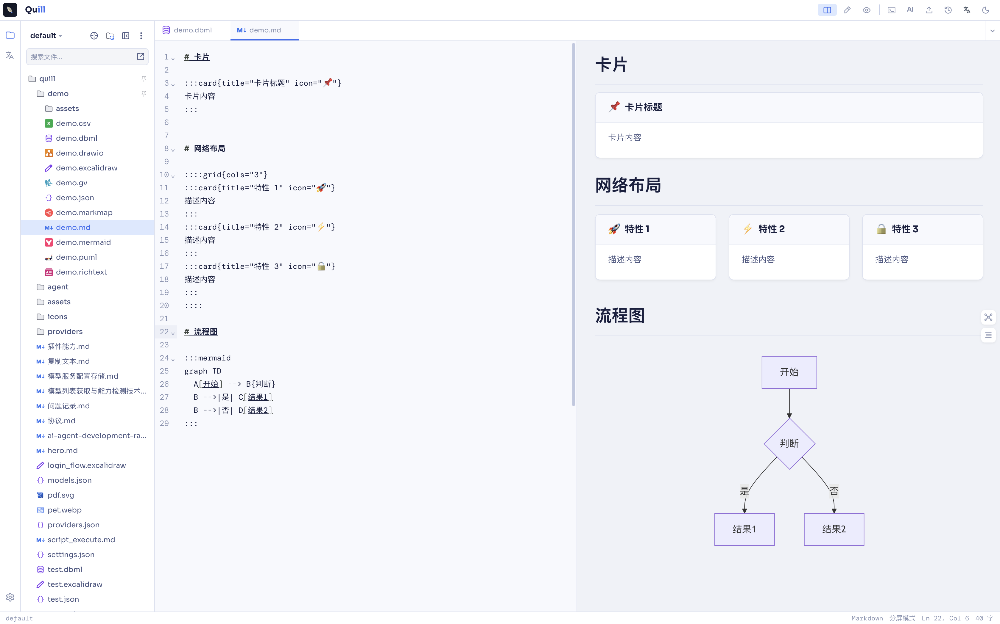
</p>

### Vista previa universal

Visualiza documentos de Office, audio/vídeo, archivos comprimidos, libros electrónicos, presentaciones y planos sin salir de Folyn — no hace falta software adicional.

<p align="center">
  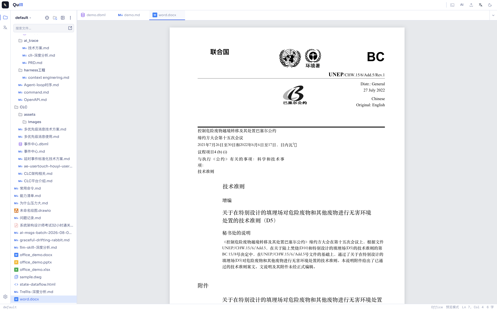
</p>

### Integración profunda de IA

Sin atarse a un proveedor — los principales agentes CLI adaptados directamente al editor:

- **Claude Code**
- **Codex CLI**
- **Gemini CLI**
- **Opencode**
- **Pi Code Agent**
- **Qoder**

Configura las rutas CLI en Settings → AI. Cambia libremente entre proveedores según la tarea o la preferencia.

<p align="center">
  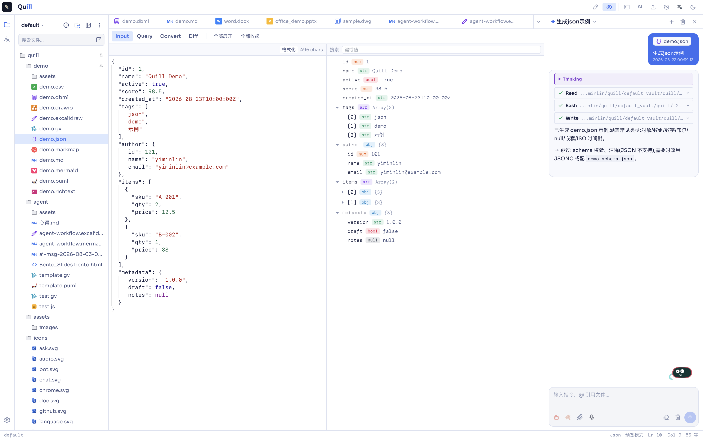
</p>

### Asistente mascota de escritorio

Residente en el escritorio, envía recordatorios de calendario y cambios de tarea al frente; un clic abre la ventana de chat con el LLM para preguntar sin interrumpir el ritmo de trabajo.

Las apps externas (scripts, cron, CI) pueden disparar notificaciones de la mascota vía una API HTTP local — por defecto `127.0.0.1:17382`, `POST /pet/action` envía una burbuja, soportando `target` para navegación, `launch` para abrir URL/app, y `actions` para botones de burbuja. Ver [`docs/pet-notify-api.es.md`](docs/pet-notify-api.es.md).

<p align="center">
  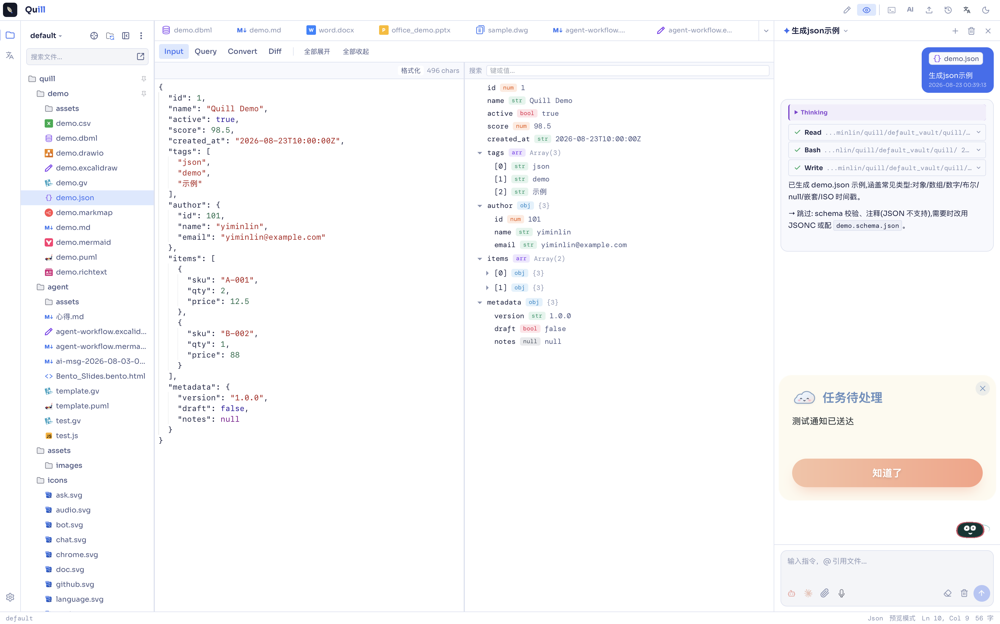
</p>

### Terminal integrada

Abre un panel de terminal en el espacio de trabajo de Folyn, junto al editor, con rutas de archivo sincronizadas automáticamente. Claude Code / Codex CLI / otros agentes pueden modificar el documento actual directamente; las ediciones de IA aparecen en el editor al instante. La salida de comandos se puede re-pegar en el cursor — “editar → invocar → re-pegar” se comprime en un solo flujo.

<p align="center">
  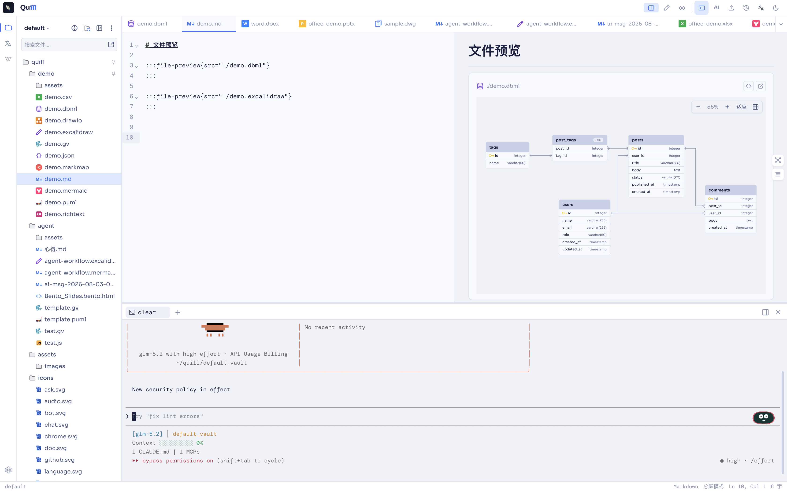
</p>

### Recolección de actividad

Las extensiones recolectoras de la tienda de extensiones registran lo que ocurre en tu equipo — cambios de la ventana en primer plano, creación/modificación/eliminación de archivos, commits/PR/issues de GitHub y eventos enviados por herramientas externas mediante un webhook local — en una base de datos almacenada dentro del vault. Nada sale de tu dispositivo.

La pestaña de Actividad convierte los eventos brutos en una línea de tiempo del día y un grafo de relaciones entre entidades (personas, reuniones, repositorios, documentos, tareas). Los informes diario, semanal y mensual se escriben como notas Markdown en el vault; con un prompt personalizado, el cuerpo del informe lo genera el LLM en lugar de una plantilla fija, y la mascota de escritorio puede avisarte cuando el informe está listo.

<p align="center">
  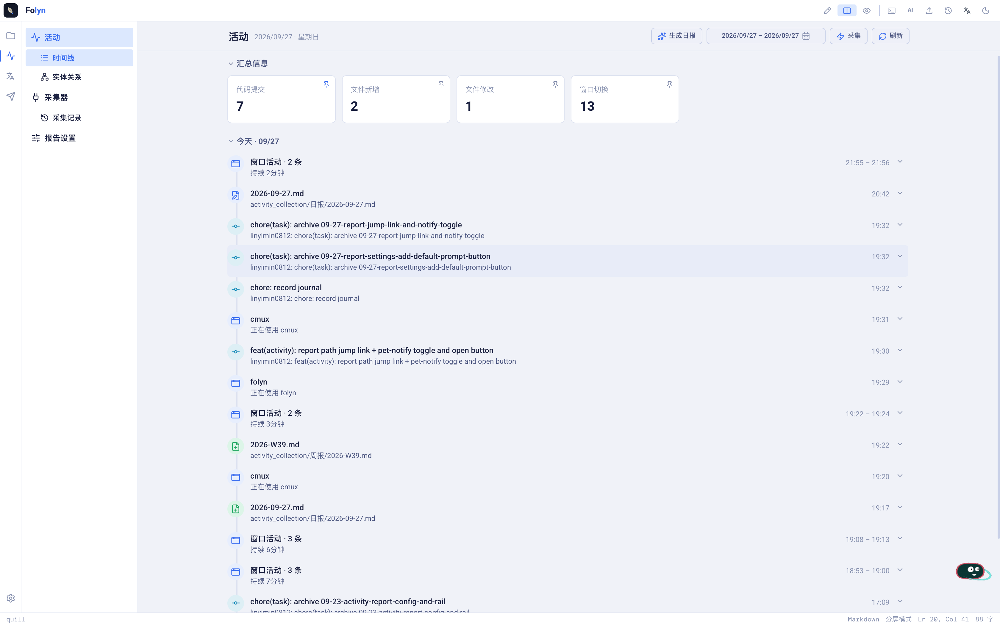
</p>

<p align="center">
  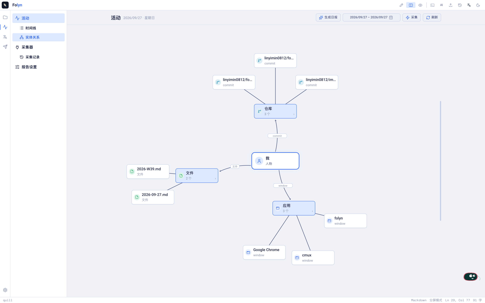
</p>

Cada recolector se puede activar/desactivar por separado con su propio intervalo de sondeo — o escribe el tuyo con el SDK de extensiones.

### Sistema de extensions

Arquitectura de microkernel + SDK de extension; el núcleo se mantiene ligero y las funciones se cargan bajo demanda:

- **Traducción** — Procesamiento de contenido multilingüe (integrada)
- **Texto enriquecido / DBML / visor de archivos** — Extensions de edición y visualización de la tienda de extensions
- **Recolectores de actividad** — Los recolectores de ventana, archivos, GitHub y webhook de la tienda de extensiones registran eventos para la pestaña de Actividad

Extensiones de terceros soportadas; ver `docs/extensions.html`.

<p align="center">
  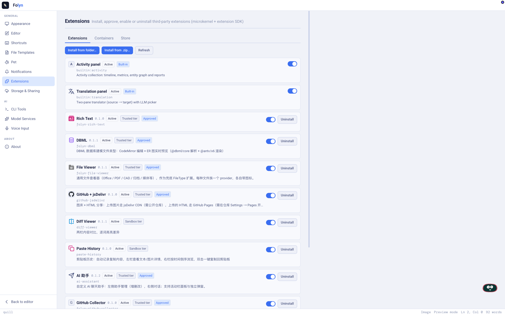
</p>

### Entrada por voz

El habla se transcribe a texto en tiempo real y se pule automáticamente — eliminando muletillas y pausas — y se pega en el cursor. Actualmente solo macOS; Windows aún no soportado.

<p align="center">
  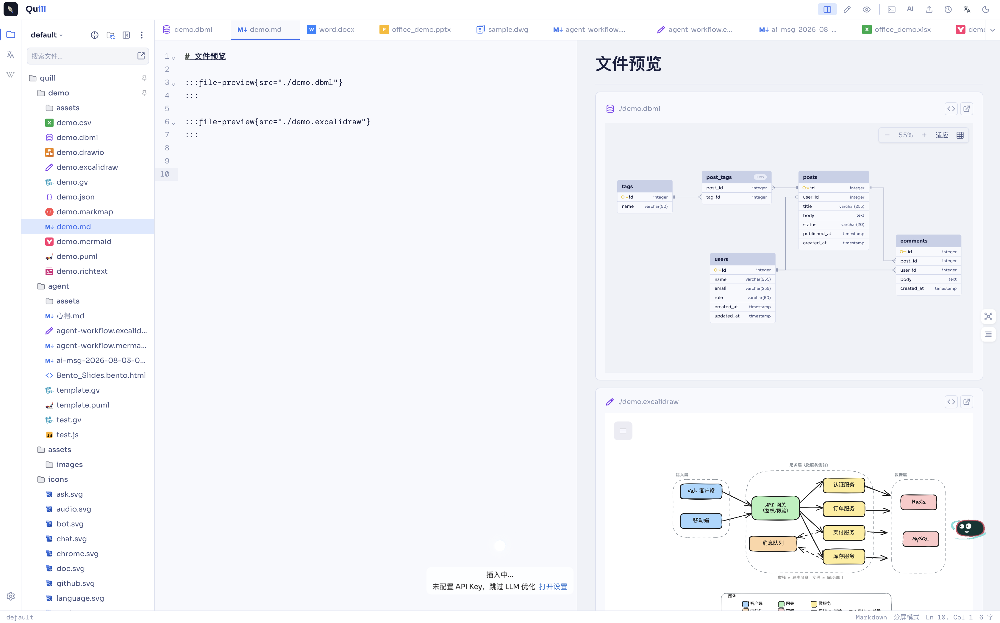
</p>

## For Developers

### Tech Stack

| Layer | Technology |
|-------|-----------|
| Shell | Tauri 2 (Rust) |
| Frontend | React 18, Vite 6, TypeScript |
| Editor | CodeMirror 6 |
| Markdown | unified / remark / rehype pipeline |
| State | Zustand 5 |
| Styling | Tailwind CSS 3 |
| Monorepo | pnpm workspaces |

### Project Structure

```
folyn/
├── apps/
│   └── desktop/              # Tauri desktop app
│       ├── src/              # React frontend
│       │   ├── components/   # shell, editor, AI, sidebar, file-types, ...
│       │   ├── editor/       # CodeMirror extensions
│       │   ├── hooks/        # React hooks
│       │   ├── store/        # Zustand stores
│       │   └── utils/        # Utility modules
│       └── src-tauri/        # Rust backend (Tauri commands)
├── packages/
│   ├── cli-adapter/          # AI CLI adapter abstraction (Claude / Codex / Gemini / Opencode / Pi / Qoder)
│   ├── container-extensions/    # Markdown container directive extensions
│   ├── extension-host/          # Extension host runtime
│   ├── extension-sdk/           # Extension SDK for third-party authors
│   ├── create-folyn-extension/  # Extension scaffolding CLI
│   └── vault-provider/       # Vault storage provider abstraction
├── package.json
├── pnpm-workspace.yaml
└── tsconfig.base.json
```

### Extension Points

- **Paquete `cli-adapter`** — Implementa la interfaz de adaptador para conectar un nuevo Agent de CLI
- **Paquete `container-extensions`** — Extensions de contenedor `:::directive` personalizados, registrados en el menú slash
- **Paquete `vault-provider`** — Backends de almacenamiento personalizados (más allá de local / GitHub / WebDAV / S3)
- **`extension-host` + `extension-sdk`** — Extensions de terceros registran capacidades vía el SDK; el microkernel los carga bajo demanda
- **`create-folyn-extension`** — CLI de scaffolding para iniciar rápidamente un nuevo extension
- **Tipos de archivo** — Registra un nuevo Handler bajo `apps/desktop/src/components/file-types/` para extender tipos de archivo

Ver `docs/extensions.html` para detalles.

### Diagramas de arquitectura

Diagramas de diseño del sistema de extensiones y del pipeline de recolección de actividad (fuentes editables en `docs/assets/diagrams/`):

<p align="center">
  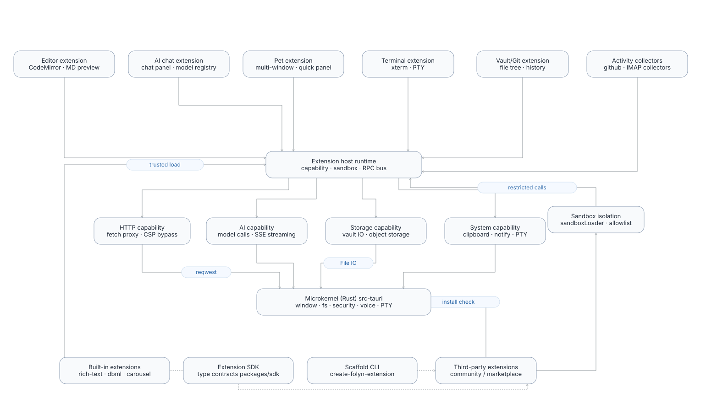
</p>

**Micronúcleo + extensiones** — el runtime del host de extensiones media entre las extensiones funcionales y los servicios de capacidad del micronúcleo en Rust; las extensiones de terceros entran por la capa de aislamiento sandbox.

<p align="center">
  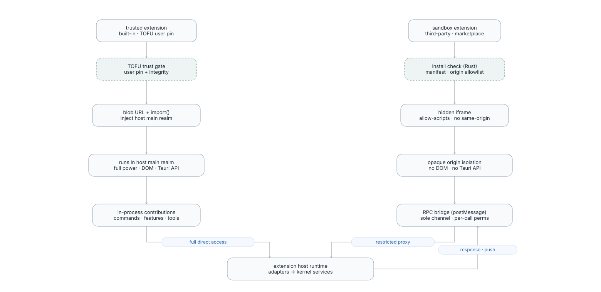
</p>

**Extensiones trusted / sandbox** — los paquetes trusted se fijan por TOFU y se ejecutan en el realm principal del host; los paquetes sandbox se ejecutan en un iframe de origen opaco, sin DOM ni API de Tauri.

<p align="center">
  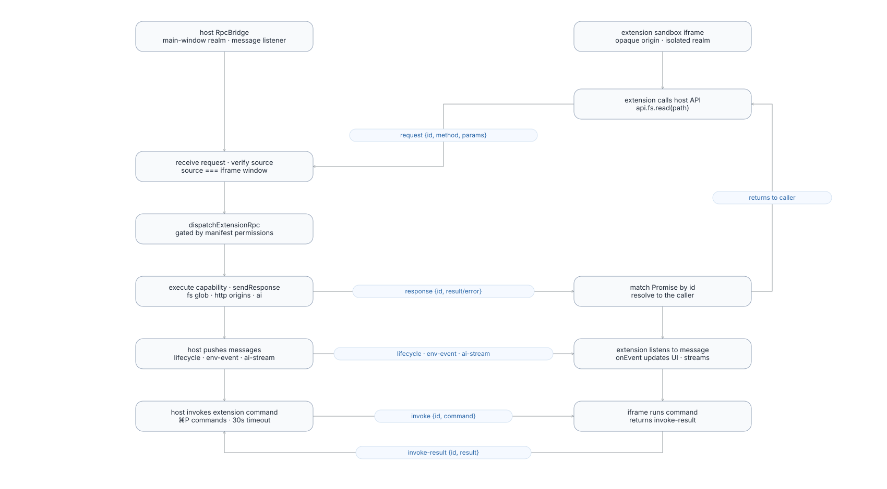
</p>

**Protocolo RPC postMessage** — request/response, push del host e invocación inversa de comandos a través de la frontera host/iframe, con verificación de permisos por llamada.

<p align="center">
  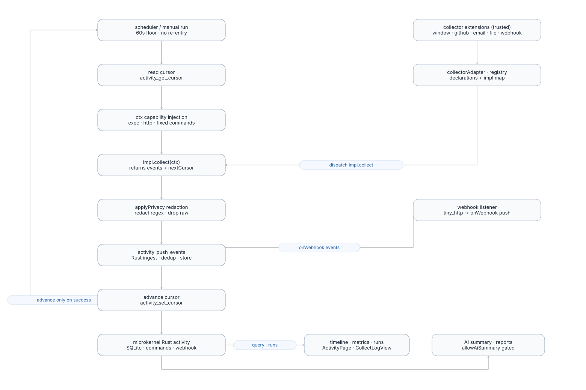
</p>

**Colectores de actividad** — el runtime de poll/webhook impulsa el bucle recolectar → anonimizar → ingerir → avanzar cursor; el cursor solo avanza tras un push exitoso.

<p align="center">
  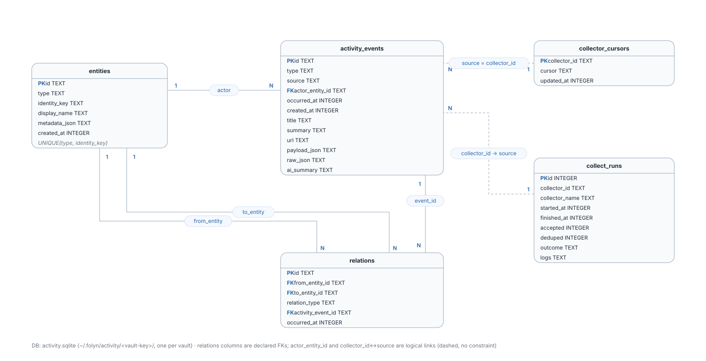
</p>

**Esquema de la base de datos de actividad** — tablas SQLite por vault para eventos, entidades, relaciones, cursores de colector e historial de ejecuciones.

<p align="center">
  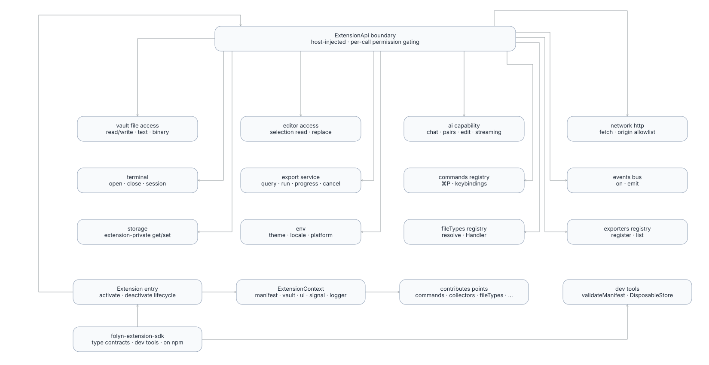
</p>

**Superficie del SDK** — los contratos de tipos publicados como [`folyn-extension-sdk`](https://www.npmjs.com/package/folyn-extension-sdk): entrada Extension, frontera de capacidades ExtensionApi (vault, editor, ai, network, terminal, export, commands, events, storage, env, registros), puntos de declaración contributes y herramientas de dev.

## Getting Started

### Prerequisites

- [Node.js](https://nodejs.org/) >= 20
- [pnpm](https://pnpm.io/) >= 9
- [Rust](https://www.rust-lang.org/tools/install) (latest stable)
- Dependencias del sistema de Tauri 2 — ver [Tauri prerequisites guide](https://v2.tauri.app/start/prerequisites/)

### Install & Run

```bash
# Install dependencies
pnpm install

# Start development (frontend + Tauri dev window)
pnpm dev

# Build the frontend only
pnpm build

# Build the desktop app (platform-specific installer)
pnpm build:app
```

## License

MIT
