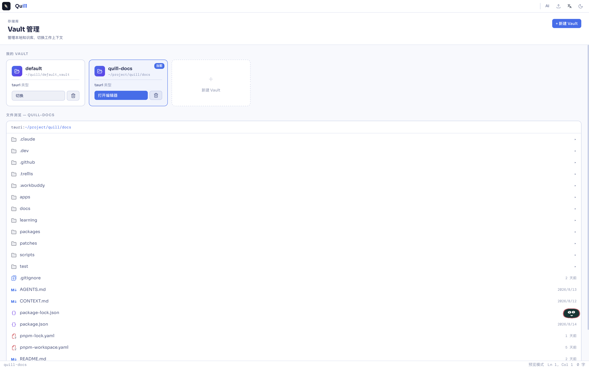
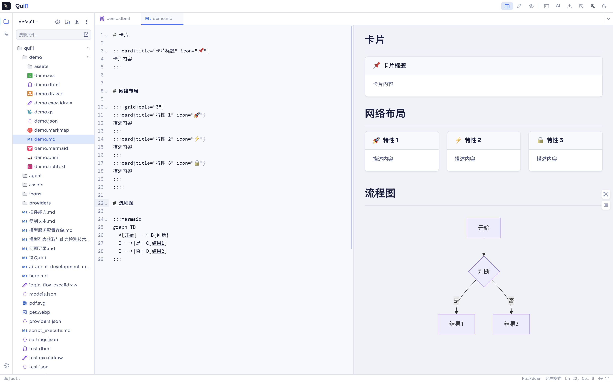
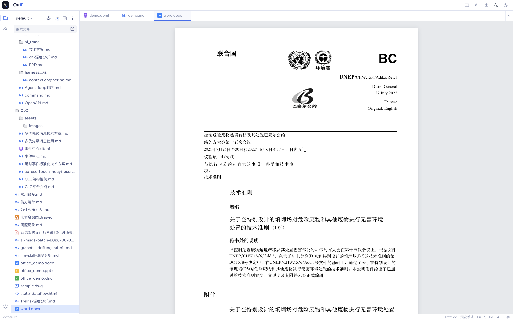
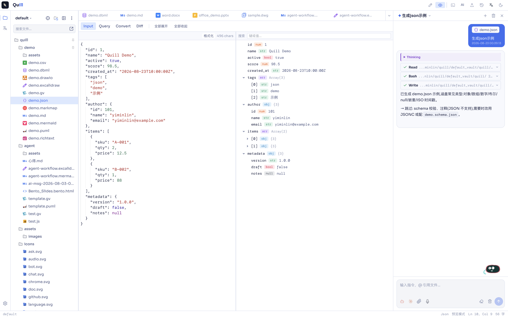
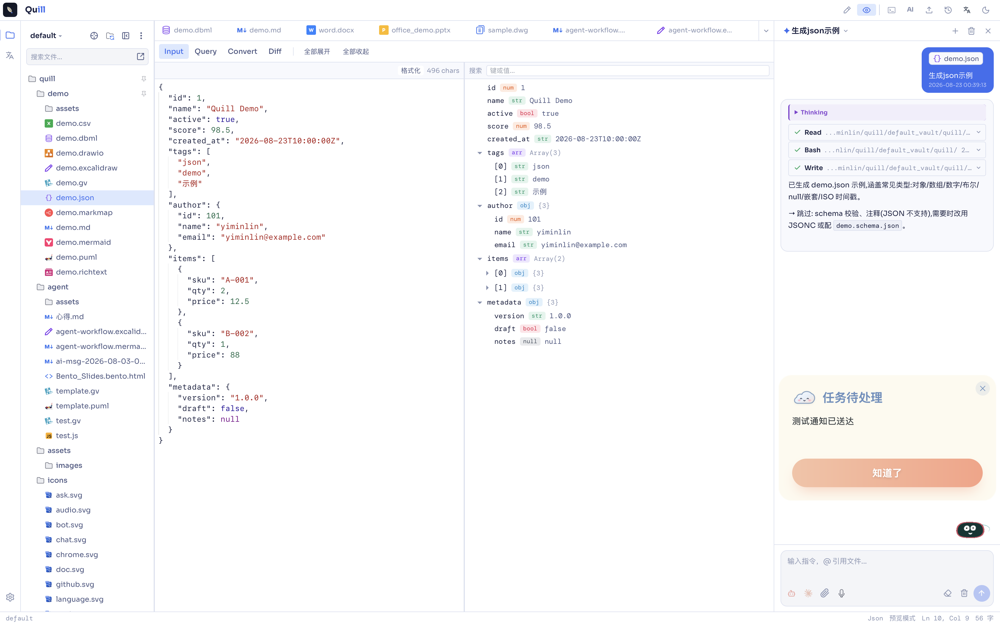
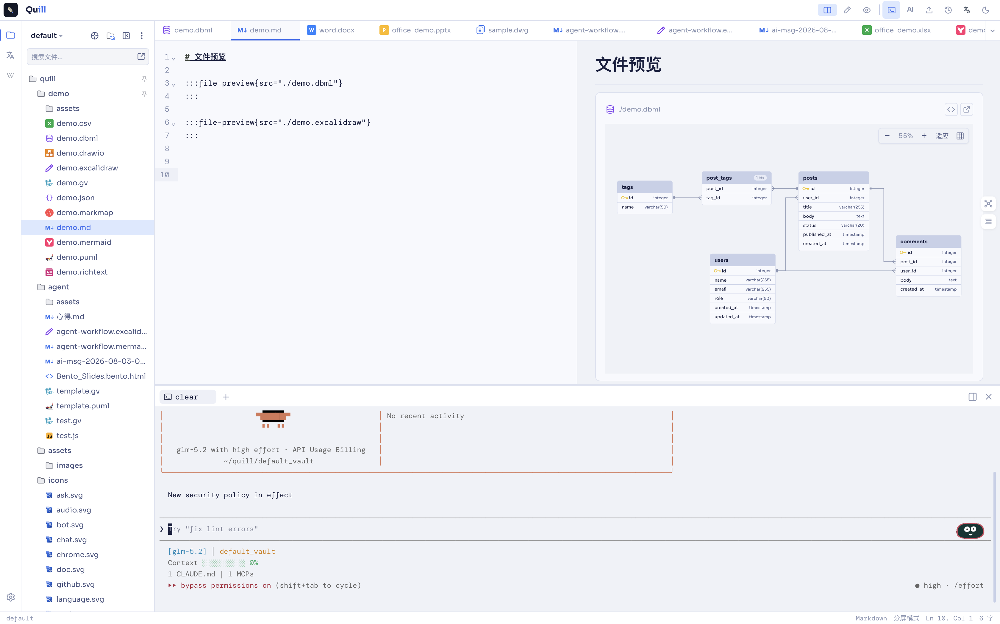
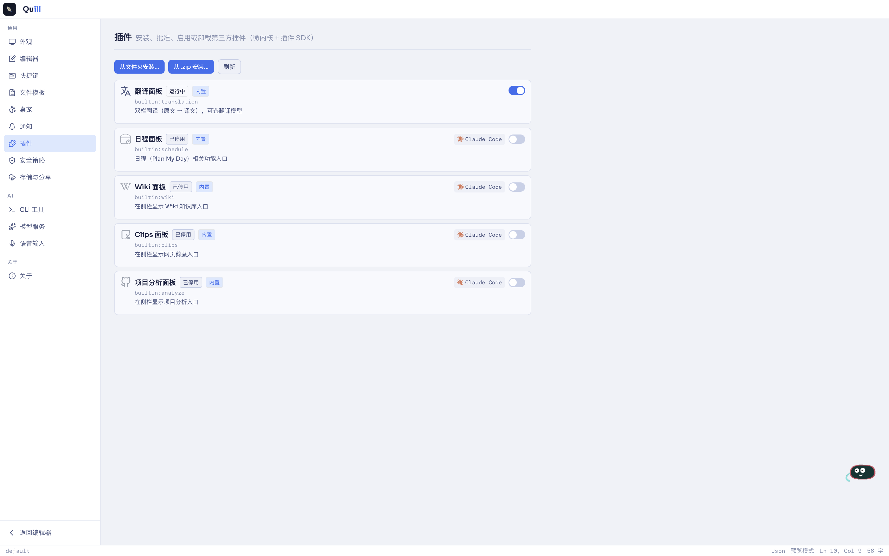
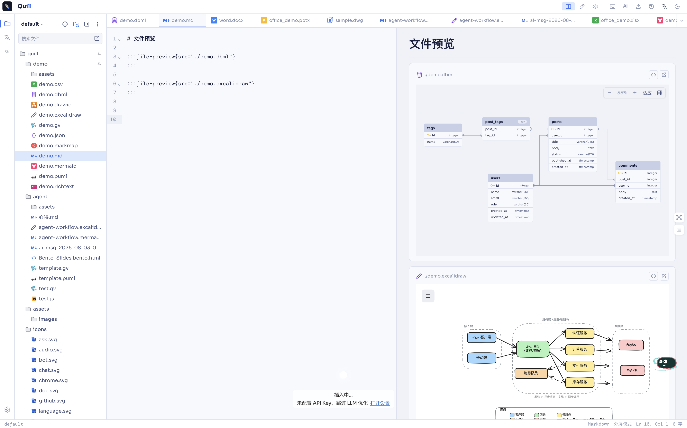

<h1 align="center">Quill</h1>

<p align="center">
  本地优先 · 仓库隔离 · AI 原生<br/>
  Local-first, vault-based, AI-native knowledge workspace.
</p>

<p align="center">
  
  
  
  
</p>

---

> 一个应用，承载全部上下文。以 Vault 隔离每一份数据，用一套编辑器容纳 markdown、白板、ER 图、思维导图，再把 AI 代理直接接入工作流——所有内容始终留在你自己的设备上。

## Why Quill

- **Vault 多仓库隔离** — 为每个项目、每份笔记开一个独立仓库，数据互不干扰，随时切换。本地是唯一真源。
- **多格式编辑** — Markdown（含容器插件：Button / Callout / Card / Tabs / Timeline / Steps / Grid / FilePreview / StatusTag / Collapsible，以及 Graphviz / Mermaid / PlantUML 图表容器）、富文本、CSV、JSON、markmap 思维导图、dbml ER 图、drawio 架构图、excalidraw 手绘白板、graphviz DOT 图——一个编辑器全部搞定。
- **全格式预览** — Office 文档、音视频、压缩包、电子书、演示与图纸，不离开 Quill 就能查看。
- **AI 深度集成** — 内置适配 Claude Code、Codex CLI、Gemini CLI、Opencode、Pi Code Agent、Qoder 六种 CLI 代理，跨模型厂商自由切换，不绑定单一供应商。
- **桌宠助手** — 常驻桌面的小伙伴，负责推送日程提醒、任务变更通知，一点即可唤起大模型对话。
- **应用内终端** — 在 Quill 中直接打开终端，调用 Claude Code / Codex 等 CLI 代理读写当前文档，无需窗口切换。
- **插件系统** — 微内核 + 插件 SDK 架构，翻译、日程、Wiki、Clips 剪藏、项目分析均以插件形式提供，支持第三方扩展。
- **语音输入** — 语音转文字并自动润色，直接粘贴到光标处（目前仅支持 macOS）。

## For Users

### 首次运行提示

应用未做代码签名,首次运行时会触发系统安全拦截,按以下步骤放行即可:

- **Windows**:首次运行会看到 SmartScreen "Windows 已保护你的电脑" 警告。点击 **更多信息 → 仍要运行**。
- **macOS**:安装完成后首次打开若提示"无法打开"或"已损坏",在 Terminal 中执行:
  ```bash
  xattr -cr /Applications/Quill.app
  ```
  然后重新从启动台打开。

### Vault 多仓库隔离

为每个项目、每份笔记开一个独立仓库。每个 Vault 都是一套独立的数据空间——笔记、附件、插件配置都各自存放,切换 Vault 就像切换一整套工作环境。数据保存在本地设备,不依赖云端账号。

<p align="center">
  
</p>

### 多格式编辑

- **Markdown** — 标准语法 + 一套容器插件:Button / Callout / Card / Collapsible / FilePreview / Grid / StatusTag / Steps / Tabs / Timeline,以及 Graphviz / Mermaid / PlantUml 图表容器
- **富文本** — 所见即所得,适合不需要 markdown 语法的排版场景
- **结构化数据** — CSV、JSON 直接编辑
- **思维导图** — markmap,markdown 大纲自动生成可视化结构
- **建模与制图** — dbml (ER 图) / drawio (架构图、流程图) / excalidraw (手绘白板) / graphviz (DOT) / plantuml / mermaid

<p align="center">
  
</p>

### 全格式预览

不离开 Quill 查看 Office 文档、音视频、压缩包、电子书、演示与图纸——不必额外安装软件。

<p align="center">
  
</p>

### AI 深度集成

不绑定单一模型厂商,把主流 CLI 代理直接适配进编辑器:

- **Claude Code**
- **Codex CLI**
- **Gemini CLI**
- **Opencode**
- **Pi Code Agent**
- **Qoder**

在 Settings → AI 里配置 CLI 路径即可。跨模型厂商按任务需要或个人偏好自由切换。

<p align="center">
  
</p>

### 桌宠助手

常驻桌面,负责把日程提醒、任务变更推送到眼前;点击即可唤起大模型 Chat 对话窗口,随时提问,不打断当前工作节奏。

外部应用（脚本、cron、CI）可通过本机 HTTP API 触发桌宠通知——默认 `127.0.0.1:17382`，`POST /pet/action` 即可推送气泡，支持 `target` 跳转、`launch` 外部启动 URL / 应用、`actions` 气泡按钮。详见 [`docs/pet-notify-api.zh.md`](docs/pet-notify-api.zh.md)。

<p align="center">
  
</p>

### 应用内终端

在 Quill 工作区内打开终端面板,与编辑器并列展示,文件路径自动同步。Claude Code / Codex CLI 等代理可直接对当前文档发起修改,AI 改完立刻在编辑器中可见。命令输出可回填到光标处,"编辑—调用—回填"压成一条流水线。

<p align="center">
  
</p>

### 插件系统

微内核 + 插件 SDK 架构,核心保持轻量,功能按需加载:

- **翻译** — 多语言内容处理
- **日程** — 任务设置 / 通知提醒 / 专注番茄 / 任务看板
- **Wiki 知识库** — 以 Wiki 方式组织和链接知识条目,构建可互相跳转的知识网络
- **Clips 剪藏** — 获取网页内容并自动总结摘要页面
- **项目分析** — 分析 GitHub 项目,输出 HTML 格式分析结果

支持第三方插件扩展,详见 `docs/plugins.html`。

<p align="center">
  
</p>

### 语音输入

说话内容实时转写成文字并自动润色,去除口语化重复和停顿,直接粘贴到当前光标位置。目前仅支持 macOS,Windows 暂不支持。

<p align="center">
  
</p>

## For Developers

### Tech Stack

| Layer | Technology |
|-------|-----------|
| Shell | Tauri 2 (Rust) |
| Frontend | React 18, Vite 6, TypeScript |
| Editor | CodeMirror 6 |
| Markdown | unified / remark / rehype pipeline |
| State | Zustand 5 |
| Styling | Tailwind CSS 3 |
| Monorepo | pnpm workspaces |

### Project Structure

```
quill/
├── apps/
│   └── desktop/              # Tauri desktop app
│       ├── src/              # React frontend
│       │   ├── components/   # shell, editor, AI, sidebar, file-types, ...
│       │   ├── editor/       # CodeMirror extensions
│       │   ├── hooks/        # React hooks
│       │   ├── store/        # Zustand stores
│       │   └── utils/        # Utility modules
│       └── src-tauri/        # Rust backend (Tauri commands)
├── packages/
│   ├── cli-adapter/          # AI CLI adapter abstraction (Claude / Codex / Gemini / Opencode / Pi / Qoder)
│   ├── container-plugins/    # Markdown container directive plugins
│   ├── plugin-host/          # Plugin host runtime
│   ├── plugin-sdk/           # Plugin SDK for third-party authors
│   ├── create-quill-plugin/  # Plugin scaffolding CLI
│   └── vault-provider/       # Vault storage provider abstraction
├── package.json
├── pnpm-workspace.yaml
└── tsconfig.base.json
```

### Extension Points

- **`cli-adapter` 包** — 实现 adapter 接口即可接入新的 CLI Agent
- **`container-plugins` 包** — 自定义 `:::directive` 容器插件,注册到 slash 菜单
- **`vault-provider` 包** — 自定义存储后端(local / GitHub / WebDAV / S3 之外)
- **`plugin-host` + `plugin-sdk`** — 第三方插件按 SDK 协议注册能力,微内核按需加载
- **`create-quill-plugin`** — 脚手架快速起一个新插件
- **文件类型** — 在 `apps/desktop/src/components/file-types/` 下注册新 Handler 即可扩展文件类型

详见 `docs/plugins.html`。

## Getting Started

### Prerequisites

- [Node.js](https://nodejs.org/) >= 20
- [pnpm](https://pnpm.io/) >= 9
- [Rust](https://www.rust-lang.org/tools/install) (latest stable)
- Tauri 2 系统依赖 — 见 [Tauri prerequisites guide](https://v2.tauri.app/start/prerequisites/)

### Install & Run

```bash
# Install dependencies
pnpm install

# Start development (frontend + Tauri dev window)
pnpm dev

# Build the frontend only
pnpm build

# Build the desktop app (platform-specific installer)
pnpm build:app
```

## License

MIT
